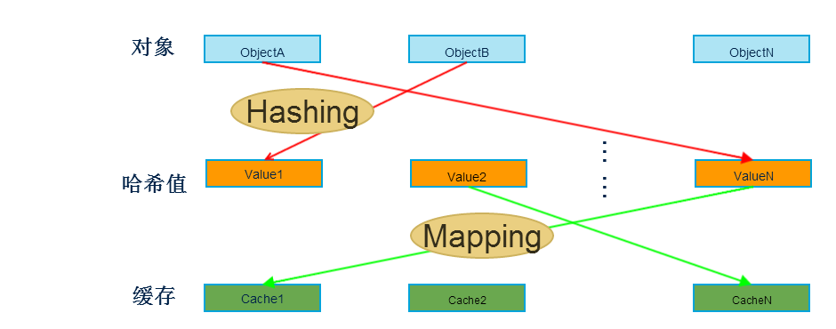
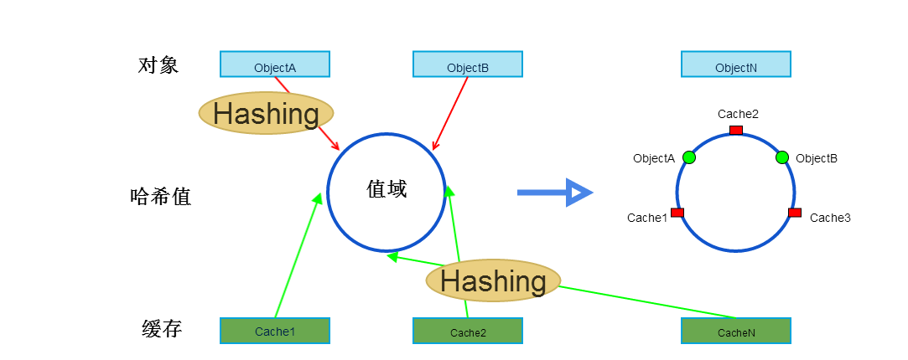

一致性哈希
===

**声明：** 所写均为个人阅读所思所想，请批判阅读。

* * *

## Theory

一致性哈希(Consistent Hashing)算法是分布式领域非常重要的算法，它的原理比较简单。其基本思想就是使用相同的hash 算法，将对象和 cache 都映射到同一个 hash 数值空间中。主要目的是当增减cache节点时，避免大规模影响cache访问有效性，提高系统维护性。

## Progress

#### 普通哈希

这种情况下，如果缓存的个数出现额增减，那么，会出现缓存失效洪流，对后端服务器形成巨大访问压力，甚至是直接导致系统崩溃不可用。一个容易想到的例子就是，当我们使用对缓存个数（N）求余的映射算法时：

|对象|哈希值|映射缓存（N=3）|
|-|-|-|
| objectA | 24 | 24%3=0 |
| objectB | 11 | 11%3=2 |
| objectN | 7 |7%3=1 |

|对象|哈希值|映射缓存（N=4）|
|-|-|-|
| objectA | 24 | 24%2=0 |
| objectB | 11 | 11%2=3 |
| objectN | 7 | 7%4=3 |

增加节点后，后两个对象原本映射的缓存节点都变化了，因此访问均失效。对于大型系统而言，增减节点应该是经常需要遇到的情况，一旦出现大量数据缓存无效的情况，后果是不堪设想的。因此，我们必须寻找最大程度降低风险的新方法，**一致性哈希**就是最常用的一种。

#### 一致性哈希

如图所示，可以规定，顺时针方向凡是在哈希值落在两个哈希节点之间的对象，其被存储在前一个中。如图中objectA存储在cache1，objectB存储在cache2。这样，当增减缓存节点时，影响的对象仅限于新增节点与后方（顺时针）节点间的对象了。这就大大降低了可能的缓存失效对象数量，从而提高系统的可维护性。

两种方式的区别不在于**哈希算法**的不同，而在于将对象哈希值**映射到缓存节点的策略（算法）**不同。

## Problems

#### Cach's HashCode

cache 的 hash 计算，一般的方法可以使用 cache 机器的 IP 地址或者机器名作为hash 输入。必须保证cache尽量均匀的分布在hash值区间内。一般的缓存机器组的IP或者机器名都是很相近的，那么是否能够保证其对应的hashcode是可以均匀分布在hash值区间内呢？最糟糕的情况，如果两个cache的hash值是相邻的，那么，必然是不合理的。因此，在实际过程中必须检测这种情况并处理,比如后文提到的**虚拟节点**。

#### Virtual Node

> hash 算法并不是保证绝对的平衡，如果 cache 较少的话，对象并不能被均匀的映射到 cache 上，比如在上面的例子中，仅部署 cache A 和 cache C 的情况下，在 4 个对象中， cache A 仅存储了 object1 ，而 cache C 则存储了 object2 、 object3 和 object4 ；分布是很不均衡的。
>
> 为了解决这种情况， consistent hashing 引入了“虚拟节点”的概念，它可以如下定义：
>
> “虚拟节点”（ virtual node ）是实际节点在 hash 空间的复制品(replication)，一实际个节点对应了若干个“虚拟节点”，这个对应个数也成为“复制个数”，“虚拟节点”在 hash 空间中以 hash 值排列。
> 摘自[reference2][2]

## Reference

+ [Consistent Hashing and Random Trees:Distributed Caching Protocols for Relieving Hot Spots on the World Wide Web][1]
+ [一致性 hash 算法][2]

[1]: http://www.akamai.com/dl/technical_publications/ConsistenHashingandRandomTreesDistributedCachingprotocolsforrelievingHotSpotsontheworldwideweb.pdf
[2]: http://blog.csdn.net/sparkliang/article/details/5279393
