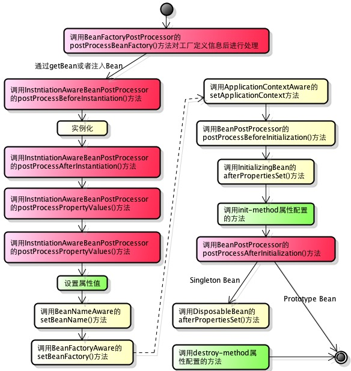
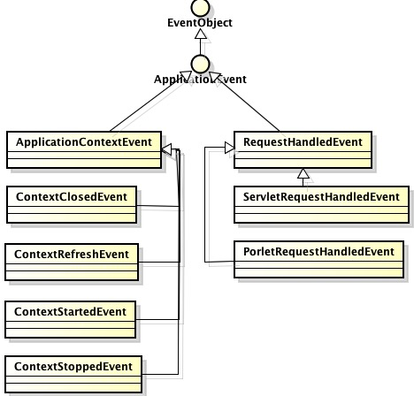
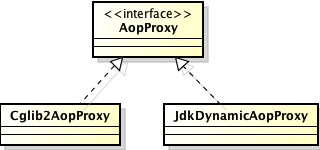
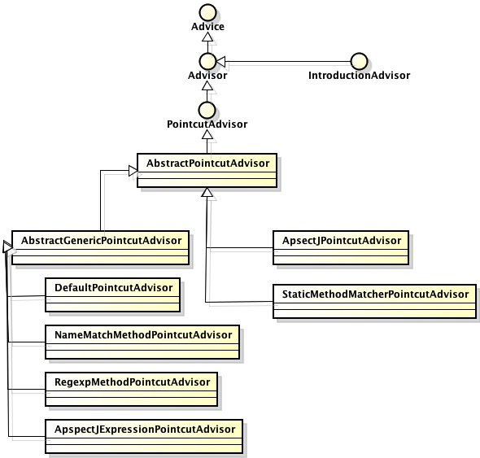
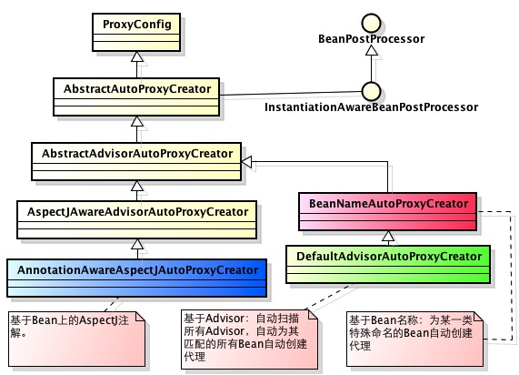
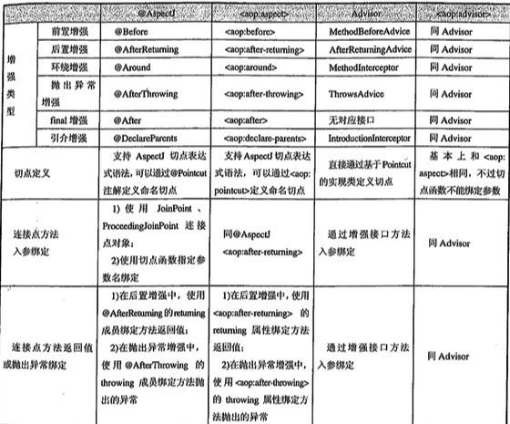

Spring笔记整理
===

**声明：** 所写均为个人阅读所思所想，请批判阅读。

* * *

## Spring IOC

+ IOC即控制反转，其更加直接易懂的名字是Matin Fowler提出的“DI即依赖注入”。就是将**客户类**对**某一接口实现类**的**依赖**，交由第三方的容器（IOC/DI)去控制。

+ 依赖注入类型：

1. 构造函数注入
2. 属性注入
3. 接口注入（不提倡）

+ 类装载器就是寻找类的字节码并构造出类再JVM内部表示的对象组件。

+ 装载类的步骤：

1. 查找和导入class文件
2. 检验class文件，给类的静态变量分派空间，将符号引用转变为直接引用。
3. 对类的初始化变量和代码进行初始化。

+ 类装载器主要有：

1. 根装载器 C++实现，不是ClassLoader的子类，Java中不可见，主要转载JRE核心类库。
2. ExtClassLoader  是ClassLoader的子类，负责装在JRE中ext目录下的类。
3. AppClassLoader 是ClassLoader的子类，负责装在classpath下的类。

它们之间存在父子关系，即**根装载器 --> ExtClassLoader --> AppClassLoader**. 

+ JVM装载类采用“全盘委托制”：除非显示引用别的装载器，否则，该类及其所依赖和引用的类也由该装载器载入。并且，先委托父装载器进行查找载入，逐级向下由各级装载器尝试装入类，最终到当前装载器。

如此设定主要是出于安全原因。试想如果有人恶意编写一个基础类（java.lang.String）,如果采用这种机制，就会避免被恶意载入。

<blockquote>
常见的java.lang.NoSuchMethodError错误的根源就在类装载机制：
1. 相应的类没有装载
2. 同时有多个版本的类，类装载器正好装载的那个版本类不存在此方法。
</blockquote>

+ ClassLoader是java.lang中的抽象类，其主要方法如下：

1. loadClass(String name, boolean resolve) name必须是类的完全限定名。如果只是确定类是否存在，或者只需要找到类的超类等，就不需要对类进行解析，可以将resolve设置为false.

2. findeSystemClass(String nameg) 该方法是JVM默认的装载机制。

3. defineClass(String name, byte[] b, int len, int off) 将类文件二进制数组转换为JVM中的java.lang.Class对象。

4. findLoadedClass(String name) 判断是否已装载某类。如果已装载，返回class对象；否者，返回null.

5. getParent() 获取父装载器，因为根装载器无法获得，因此会返回null.

+ 每个类在JVM中都有一个java.lang.Class对象，它提供基本的类结构元信息。所有的基本类型，甚至void都存在一个class对象，该对象在装载类时有JVM创建。

+ JDK提供的资源访问器是：java.net.URL和File。它们并不支持从类路径或WEB上下文中获取资源。因此，Spring设计了Resource接口。Spring使用其装载所有的资源。

+ Resource接口的实现类：

1. ByteArrayResource
2. ClasspathResource
3. FileSystemResource
4. InputStreamResource
5. ServletContextResource
6. UrlResource

+ 资源路径表示：

|名称|前缀|资源类|
|--|--|--|
|类路径|classpath:|ClasspathResource|
|网络路径|ftp: http:|UrlResource|
|文件|file:|FileSystemResource|

<blockquote>
三个独立的模块jar包，均有com.unicorn包，该包下分别有如下配置文件：

|模块|配置文件|
|--|--|
|1|application-data.xml|
|2|application-service.xml|
|3|application.xml|

如果使用**classpath:com/unicorn/application\*.xml**，只会加载某一个包中的配置文件。

如果使用**classpath\*:com/unicorn/application\*.xml**，三个配置文件均会加载。 
</blockquote>

+ Ant风格资源地址三种匹配符：

1. `?`: 匹配一个字符
2. `*`: 匹配任意个字符
3. `**`: 匹配多层路径

+ BeanFactory是Spring的基础设施，面向Spring本身；ApplicationContext面向所有Spring应用开发者。

+ Spring中资源加载的基本类是`PathMatchingResourcePatternResolver`。

+ ApplicationContext主要的实现类是：`ClassPathXmlApplicationContext`和`FileSystemApplicationContext`。

+ ApplicationContext除了实现BeanFactory相关接口（类）外，还实现了如下接口以扩充功能：

1. ApplicationEventPublisher 发布应用上下文事件，如容器启动、关闭事件。实现`ApplicationListener`接口的Bean可以接收到容器事件。
2. MessageResource 提供i18n国际化消息访问。
3. ResourcePatternResolver 提供类似`PathMatchingResoucePatternResolver`的资源加载功能。
4. LifeCycle 该接口提供start和stop方法，主要用于异步控制。ApplicationContext会将start和stop的信息传递给容器中所有实现了该接口的bean。

+ WebApplicationContext是专为WEB容器准备的，允许从Web根目录的路径中装载配置文件。其被作为属性（建为`ROOT_WEB_APPLICATION_CONTEXT_ATTRIBUTE`）放置在ServletContext中，可以通过WebApplicationContextUtils获取。WebApplicationContext也保持了对ServletContext的引用。

```
(WebApplicationContext) servletContext.getAttribute(
    WebApplicationContext.ROOT_WEB_APPLICATION_CONTEXT_ATTRIBUTE);
```

+ 非WEB应用下，只有Singleton和Prototype两种Bean作用域。而WebApplicationContext中添加了三个新的Bean作用域：Request、Session、Global Session。

+ WebApplicationContext的初始化需要ServletContext，因此，spring提供了两个类支持：

1. org.springframework.web.context.ContextLoaderServlet
2. org.springframework.web.context.ContextLoaderListener

将其配置在WEB容器的web.xml即可。

+ 如果要使用log4j引擎，可以将log4j的配置文件放在WEB-INF/class下，如果需要放到其他位置，那么需要使用spring提供的支持类：

1. Log4jConfigServlet
2. Log4jConfigListener

+ 需要注意的是，log4j需要保证在WebApplicationContext之前初始化，因此，如果使用servlet，则Log4jConfigServlet要先于ContextLoaderServlet启动（配置startup）。如果使用listener，则Log4jConfigListener必须配置在ContextLoaderListener之前。

+ 使用HierarchicalBeanFactory，可以建立父子关联的容器体系。子容器可以访问父容器的Bean，反之，不可。子容器中可以存在与父容器id相同的bean。

+ 父子容器的一个典型应用就是SpringMVC。在SpringMVC中，展现出Bean存在于子容器中，而业务层和持久层的Bean位于父容器中，这样，就隔离了Bean。

+ Spring中的Bean生命周期有两个方面：

1. Bean的作用域
2. 实例化Bean时所经历的一系列阶段

+ Spring Bean的生命周期：



其生命周期管理方法分为三个层面

1. Bean自身方法【绿色】 
2. Bean级接口实现【黄色】 处理个性

```
- BeanNameAware
- BeanFactoryAware
- ApplicationContextAware
- InitializingBean
- DisposableBean。
```

这类接口相当于将Bean与Spring框架紧耦合了，因此，应当尽可能的少用，可采取其他替代方式。

3. 容器级接口实现【红色】 处理共性

```
- InstantiationAwareBeanPostProcessor
- BeanPostProcessor
- BeanFactoryPostProcessor(实现类如：PropertyPlaceholderConfigurer等)
```

可以同时实现多个容器级接口，但必须同时实现org.springframework.core.Ordered接口。

+ Bean的id必须唯一，并且符合xml命名规则。

+ Bean的name可以有多个，使用`,`分隔。

+ 注入方式

1. 属性注入
2. 构造函数注入
3. 工厂方法注入

```
<bean factory-bean="" factory-method="" />
```

+ ![CDATA[....]]的作用类似于转义，即将其中的字符全部当做普通字符处理，避免破坏XML格式。

+ 通过ref元素可以引用其他bean，其包含三个属性：

```
<bean ...>
    <property>
        <ref bean="<id>" />
    </property>
</bean>

// 被引用的bean必须在当前配置文件
<bean ...>
    <property>
        <ref local="<id>" />
    </property>
</bean>

// 被引用的bean必须在父容器
<bean ...>
    <property>
        <ref bean="<id>" />
    </property>
</bean>
```

+ 内部Bean

```
<bean ...>
    <property ...>
        // 内部Bean
        <bean ...>
            <property ... />
            <property ...
        </bean>
    </property>
</bean>
```

内部Bean即使声明id、name、scope等，也会被忽略。scope默认是prototype。

+ 设置null值

```
<property><null /></property>
```

+ 设置级联属性

```
<property name="car.name" value="大众" />
或
<property name="car.name">
    <value>大众</value>
</property>
```

+ 引入p空间，是为了简化xml配置。

```
<bean ...>
    <property name="price" value="200" />
    <property name="shop" ref="711Shop" />
</bean>
=>
<bean p:price="200" />
<bean p:shop_ref="711Shop" />
```

+ 集合属性：List、Set、Map、Properties

+ Spring提供了4种自动装配类型：

|自动装配类型|说明|
|--|--|
|byType|根据类型|
|byName|根据类名（非完全限定名）|
|constructor|与byType类似，只不过是针对构造函数注入而言的|
|autodetect|如果bean提供了默认构造函数，则使用byType；否则，使用constructor|

+ 可以通过配置文件声明Bean之间的继承关系，但实际应用中很少用。

```
<bean id="pa" abstract="true"></bean>
<bean id="son" parent="pa"></bean>
```

+ `<idref>`标签主要是用于引用另外一个Bean的**id字面量**。

+ `depend-on`属性可以用于定义当前bean的前置依赖。

```
<bean id="A" depend-on="B,C" />
```

+ `<import resource="" />可以用于将多个配置文件整合到一个配置文件中。这在大型应用中非常有用。

+ 如果要在WEB环境下使用Request、Session、Global Session三个作用域，则需要在web.config中添加配置项：

```
<filter>
    <filter-name>requestContextFilter</filter-name>
    <filter-class>org.springframework.web.filter.RequestContextFilter</filter-class>
</filter>
<filter-mapping>
    <filter-name>requestContextFilter</filter-name>
    <url-pattern>/*</url-pattern>
</filter-mapping>

或者

<listener>
    <listener-class>
        org.springframework.web.context.request.RequestContextListener
    </listener-class>
</listener>
```

+ Gloabal Session作用域类似于Session，但仅限于Porlet应用中。

+ Java只能对接口添加动态代理，如果要给类添加动态代理，需要应用CGlib库。

+ 如果要在singleton或prototype的Bean中引用WEB作用域Bean，那么需要使用AOP。

```
<bean id="A" class="" scope="request">
    <aop:scoped-proxy />
</bean>
<bean>
    <property name="" ref="A" />
</bean>
```

+ 复杂Bean的创建，为了避免配置繁琐，可以使用FactoryBean接口。

```
// MyFactoryBeanImpl#getObject方法会代理容器的getBean方法
<bean class="MyFactoryBeanImpl"></bean>
```

+ 四种Bean注解：Component、Controller、Service、Repository

+ `<context:component-scan>`标签用于定义根据一定规则自动装配Bean。

```
// resouces-pattern功能较简单
<context:component-scan base-package="com.unicorn" resource-pattern="domain/*.class" />
// filter可以实现复杂的匹配过滤
<context:component-scan base-package="com.unicorn">
    <context:include-filter type="" expression="">
    <context:exclude-filter type="" expression="">
</context:component-scan>
```

`context:include-filter`和`context:exclude-filter`的过滤表达式设置如下：

|type|expression|description|
|--|--|--|
|annotation|com.unicorn.XxxAnnotation|所有标注该注解的类|
|assignable|com.unicorn.XxxService|所有继承该接口（或类）的类|
|aspectj|com.unicorn.*Service+|类名以Service结尾，并且继承或扩展该接口（或类）的类|
|regex|com\.unicorn\.Batch*|所有类名以Batch开始的类|
|custom|com.unicorn.MyFilter|需要继承org.spring.framework.core.type.TypeFilter|

+ @PostConstruct、@PreDestroy注解可以标注方法，其效果相当于配置文件中的`init-method`和`destroy-method`

+ Java标准库中`EventObject`、`EventListener`表达**事件**和**监听器**。Spring的事件机制扩展于此。

+ 事件源、事件管理器（监听器注册等）、事件广播通常可由一个对象承担。如果事件体系过于复杂，可以进行分拆。

+ Spring容器事件架构：



## Spring AOP

+ AOP术语

1. 连接点（Joinpoint） 

程序执行的某个**特定位置（具有边界性质）**：如类初始化前、类初始化后、方法调用前、方法调用后、方法抛出异常后等等。Spring仅支持方法的连接点，即：方法执行前、方法执行后、方法抛出异常、方法执行前后的这些执行点。

2. 切点（Pointcut）

连接点相当于数据库的记录，而切点相当于查询条件。一个切点可以匹配多个连接点。

3. 增强（Advice）

是织入到目标类连接点上的一段程序代码。

4. 引介（Introduction）

一种特殊的**增强**，它为类添加属性或方法。

5. 织入（Weaving）

将**增强**添加到目标类的过程。Spring采用动态代理织入，而AspectJ采用编译期和类装载期织入。

<blockquote>
1. 编译期织入
2. 类装载期织入
3. 动态代理织入
</blockquote>

6. 代理（Proxy）

一个类被AOP织入**增强**之后，就产生了一个新类。根据实现方式的不同，代理可能是具有统一接口类，或是目标类的子类。

7. 切面（Aspect）

切面由切点和增强（引介）组成。

+ Spring使用了两种代理机制实现动态代理：

1. JDK动态代理（基于接口）
2. CGlib动态代理（基于接口和类）

+ 动态代理即在运行时创建接口的实现类及对象。

+ JDK的动态代理主要涉及java.lang.reflect的两个类：Proxy和InvocationHandler。

1. InvocationHandler是一个接口，可以通过实现该接口定义横切逻辑，并通过反射调用目标类的代码。
2. Proxy利用InvocationHandler动态创建一个符合某一接口的实例，生成目标类的代理对象。

```
interface WxInterface {
    void A();
    Object B();
}

class PerformanceInvocationHandler implements InvocationHandler {
    
    private Object target;
    
    public PerformanceInvocationHandler(Object target) {
        this.target = target;
    }
    
    public  Object invokde(Object Proxy, Method method, Object[] args) {
        // ... 性能监控
        method.invoke(target, args);
        // ... 性能监控    
    }
}

WxInterface wxObj = new WxInterfaceImpl();
PerformanceInvocationHandler performanceHandler = new PerformanceInvocationHandler(wxObj);

WxInterface wxProxyObj = Proxy.newProxyInstance(
    wxObj.getClass().getClassLoader(),
    wxObj.getClass().getInterfaces(),
    performanceHandler
);

wxProxyObj.A();
wxProxyObj.B();
```


+ CGlib通过创建目标类的子类实现代理对象，因此，对于final，private方法，无法代理。

+ 按照**增强**在目标方法中的连接点位置，可分为：

1. 前置增强 `MethodBeforeAdvice`
2. 后置增强 `AfterReturningAdvice`
3. 环绕增强 `MethodInterceptor`
4. 异常抛出增强 `ThrowsAdvice`

<blockquote>
ThrowsAdvice是一个标记接口，但是，其内部方法的定义需要遵循如下的方法签名：

`void afterThrowing(Method method, Object[] args, Object target, Throwable t)`

1. 所有的方面名都必须是afterThrowing
2. 前三个参数是可选的，但必须要么一起提供，要么都不提供。
3. 两个定义相近的afterThrowing，spring会选择更匹配的。

以下两个方法，当发生SQLException时，会匹配前者。
`afterThrowing(SQLException ex)`
`afterThrowing(Exception ex)`
</blockquote>

5. 引介增强 因为必须通过子类继承某种增强接口来实现，因此，必须使用CGlib，而不能使用JDK动态代理。

<blockquote>
Spring定义了引介增强接口`InroductionInterceptor`，该接口没有任何方法，Spring提供了实现类`DelegatingInroductionInterceptor`，一般情况下，通过继承该实现类来定义自己的**引介增强类**。
</blockquote>

+ Spring中使用`org.springframework.aop.framework.ProxyFactory`代理工厂将**增强**织入到目标类中。

+ Spring的代理体系：



+ CGlib创建代理对象时比较费时，但代理对象的运行效率比较高；而JDK动态代理则正好相反。因此，对于单例对象，优先使用CGlib代理。

+ 在Spring配置文件中配置代理对象，使用`org.springframework.apo.framework.ProxyFactoryBean`:

```
<bean id="myServiceProxy" class="org.springframework.apo.framework.ProxyFactoryBean">
    <target-ref >
</bean>
```

+ 如果需要精确表述**增强**施加的具体方法，需要使用Spring中用于描述切点的接口：`org.springframework.aop.PointCut`，它由ClassFilter和MethodMatcher组成，前者定位**类**，后者定位**方法**。

+ 切点类型：

1. 静态切点

抽象基类`org.springframework.aop.support.StaticMethodMatcherPointcut`。默认情况匹配所有类。其包含两个子类`NameMatchMethodPointcut`和`AbstractRegexpMethodPointcut`，前者使用简单字符串匹配方法签名，后者使用正则表达式。

2. 动态切点

抽象基类`org.springframework.aop.support.DynamicMethodMatcherPointcut`。默认匹配所有类。动态匹配时，由于发生在运行时，因此，每次方法调用都会进行匹配，有可能对性能造成影响。通过与`DefatulPointcutAdvisor`结合，可以构建**动态切面**。

3. 注解切点

实现类`org.springframework.aop.support.AnnotationMatchingPointcut`。用于注解。

4. 表达式切点

接口`org.springframework.aop.support.ExpressionPointcut`主要是为了支持AspectJ切点表达式而定义的。

5. 流程切点

实现类`org.springframework.aop.support.ControlFlowPointcut`。根据程序执行的堆栈信息判断当前方法是否由某个方法直接或间接调用，从而决定是否切入。通过与`DefatulPointcutAdvisor`结合，可以构建**流程切面**，但是必须注意，流程切面的性能与**动态切面**一样，比较低下，应慎用。

6. 复合切点

实现类`org.springframework.aop.support.ComposablePointcut`是为同时实现多个切点而提供的便捷类。其所有方法均返回`ComposablePointcut`。复合切点其实就是将两个切点（Pointcut）进行交集或并集运算。Spring中还专门提供了独立的工具类`org.springframework.aop.support.Pointcuts`，以支持对切点的操作。

+ 切面类型：

<blockquote>
增强（Advice）既包含横切代码，又包含部分连接点信息（粒度较粗，针对类的所有方法之前、之后等方位），因此，可以仅仅通过增强生成一个（简单的）切面。

但是对于切点（Pointcut）而言，只包含连接点的信息，因此无法基于切点生成切面，必须结合增强。而在Spring中使用`org.springframework.aop.Advisor`表示切面，一个切面同时包含横切代码（增强Advice）和切点（Pointcut）。
</blockquote>

1. Advisor 一般切面，仅包含一个增强（Advice），没有Pointcut。因为增强（Advice）描述的粒度太粗，一般不直接使用。

2. PointcutAdvisor 具有切点的切面。有一个增强Advice和一个Pointcut。

3. IntroductionAdvisor 引介切面。应用于类层面（因为引介增强就是针对类的）。



+ Advisor都实现了Ordered接口，Spring根据切面的定义顺序，决定实际织入切面的顺序。

+ `RegexpMethodPoincutAdvisor`匹配的是方法的“全额限定名”，即包含对象名，如`XXXService.method`。

+ 除了配置`ProxyFactoryBean`创建织入切面的代理，Spring通过对`BeanPostProcessor`的应用，自动完成创建代理工作。这对于大型系统而言，可以大大简化配置。这些实现类如下：



+ 一般来说SpringAOP可以满足大部分的需求，如果不满足，可以考虑采用AspectJ（并不属于SpringAOP的范畴）。

+ Spring提供了**基于XML Schema**的AOP配置方式，其便捷程度与AspectJ相差无几。通过这个方式，**增强**并不需要继承BeforeAdvice等接口。一个schema配置例子如下：

```
<aop:config proxy-class-target="true">
    <!-- pointcut -->
    <aop:pointcut id="logPointcut" 
        expression="target(com.unicorn.XXXService) and execution(*greetTo(..))">
    </aop:pointcut>
    
    <!-- advisor -->
    <aop:advisor advice-ref="XXXAdvice" pointcut-ref="logPointcut"></aop:advisor>
    
    <!-- advisor -->
    <aop:aspect ref="XXXAdvice">
        <aop:before method="log" pointcut-ref="logPointcut"/>
    </aop:aspect>
    
    <!-- advisor -->
    <aop:aspect ref="XXXAdvice">
        <aop:after method="log" pointcut-ref="logPointcut"/>
    </aop:aspect>
</aop:config>
```

+ Spring中定义切面的四种方式：

1. AspectJ注解
2. <aop:aspect>
3. <aop:advisor>
4. 基于Advisor类

流程切面`ControlFlowPointcut`只能使用这种方式。

+ Spring中切面类型总结：



+ Spring中对DAO层的异常体系进行了统一的抽象，设定了丰富而统一的各类异常类。

## Spring Transaction

+ 事务的四个基本特性ACID:

1. 原子性 事务操作不可分割
2. 一致性 事务操作后数据状态与业务规则一致
3. 隔离性 并发事务时，不同事务具有自己的数据空间。根据并发事务之间的干扰性，可以分为多个隔离级别。
4. 持久性 一旦事务提交，则数据就保存到了数据库中。

+ 事务的隔离级别与并发性是对立的。隔离级别越高，并发性越差。

+ 


