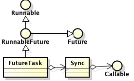
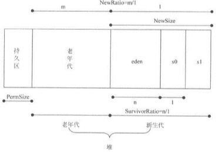

读《Java程序性能优化》
===

* * *

## 性能指标

+ 执行时间

一段代码运行到结束的时间。

+ CPU时间

函数或线程占用CPU时间。

+ 内存分配

程序运行时占用内存。

+ 磁盘吞吐量

描述系统磁盘I/O的使用情况。

+ 网络吞吐量

描述网络I/O的使用情况。

+ 响应时间

系统对用户行为或者事件作出响应的时间。响应时间越短，性能越好。

## 调优层次

### 设计调优

从架构设计层次调优。比如架构单独的分布式缓存层。

### 代码调优

针对局部代码片段。比如常见的低延迟网络程序中，需要关闭Nagle算法，因此需要设置socket的nodelay属性等等。

#### 字符串

+ StringBuilder

由于String的不可变性，对于大量字符串的`+`接操作会占用过多的内存空间，性能低效还可能内存溢出。如果只是字符串常量的`+`，那么编译器会进行自动优化。而字符串变量的情况，则需要使用StringBuilder优化。

默认情况下，其capacity为16。如果超出容量，会在原有容量上加倍扩容。因此，对于容量字符串，如果能够预先估计好StringBuilder的容量，那么可以提高性能。

+ subString

<pre>
String a = "abc";
String b = "abc";
String c = new String("abc");

a==b; // true
a==c; // false
</pre>

该函数内部实现时，使用了public String(char value[], int offset, int count)，而该构造函数为了提高性能，采用了偏移量方式，即截取的字串对象其实包含了被截取字串的所有内容，仅仅是通过标识偏移量和长度来确定实际取值。这种方式以空间换取时间，但是当原始字串很大时，多次调用该方法有可能导致内存溢出。

<pre>
String a = "<one long string>";

// 空间换时间，速度很快，但如果多次执行可能会导致内存溢出
a.subString(0, 2); 

// 重新生成一个字符对象，使得subString方法返回的字符对象失去强引用，
// 可以被垃圾回收，避免内存溢出
new String(a.subString(0, 2)); 
</pre>

<quote>
其他依赖public String(char value[], int offset, int count)构造函数的字符串方法，也可能有同样的问题，也应注意。
</quote>

+ split

split支持正则表达式，功能强大。但是对于简单的情况，可以使用功能单一性能更高的`StringTokenizer`。
也可以直接使用高效率的`indexOf`和`subString`配合实现分割字符串，这样性能最高，但是维护性较差，只有当性能非常敏感时才值得考虑自定义实现。

#### 数据结构

| 类型 | 添加 | 查找 | 删除 | 索引查找 |
|---|:---:|:---:|:---:|:---:|
| T[] | O(n) | O(n) | O(n) | O(1) |
| LinkedList<T> | O(1) | O(n) | O(1) | O(n) |
| List<T> | O(1) | O(n) | O(n) | O(1) |
| Stack<T> | O(1) | - | O(1) | - |
| Queue<T> | O(1) | - | O(1) | - |
| Hash<T> | O(1) | O(1) | O(1) | - |

#### NIO

替换BIO。

#### 技巧

+ 慎用异常

+ 尽量使用局部变量，减少全局变量

+ 位运算替代乘除

会降低可读性，慎用。

+ 表查询替代switch

<pre>
int func1(int index) {
    switch(index) {
        case 1: return 30;
        case 2: return 20;
        case 3: return 80;
        case 10: return 81;
        default: return 10;
    }
}

int func2(int index) {
    // 也可以使用数组
    Hash<Integer, Integer> m = new HashMap();
    m.put(1, 30);
    m.put(2, 20);
    m.put(3, 80);
    m.put(10, 81);
    
    Integer ret = m.get(index);
    if (ret == null) {
        return 10
    }
    return ret;
}
</pre>

+ 使用System.arraycompy函数复制数组

+ 使用缓冲读取IO

|原类|缓冲类|
|--|--|
|InputStream|BufferedInputStream|
|OutputStream|BufferedOutputStream|
|Reader| BufferedReader|
|Writer|BufferedWriter|

### 并发性能

#### Future模式

当客户端执行某种操作时，先理解返回一个票据（Future对象），之后客户端可以选择执行其他操作，在合适的时机通过该票据（Future）获取真实的结果对象。JDK中该模式的实现类图如下：

该模式的对于性能的意义在于，操作的**执行**和**获取**进行了“关注点”分离，对于某些耗时操作而言，非常有用，比如某些网络通信。

在JDK7以前，Future的获取(`get`)是阻塞式的，在JDK8引入了`CompletableFuture`，进而实现了非阻塞Future，其实质就是实现了**异步回调（CompletableFuture#thenXXX()方法）**，有点类似于.NET中的异步完成Socket。

#### Master-Woker模式

最常用的**并行模式**之一，很多软件均采用这一架构，如Nginx、NodeJS等。

#### Guarded Suspend模式

其实就是并发请求进行排队。

#### 不变模式

就是不可变对象的应用。

#### 生产者-消费者模式

经典的多线程设计模式。不多说。

#### Excutor框架

线程是越多越好，越多的线程越多上下文切换，性能反而不好，实际环境中，需要不断调优到最合适的线程数，Java中可以通过Runtime.getRuntime.availableProcessors()获取。Excutor最核心的方面就是实现了多个不同类型的“线程池”。

#### 并发数据结构

##### List

并发的List有两个: Vector和CopyOnWriteArrayList。前者是比较老的并发List，其锁粒度太大，并发性能较低。多线程环境下应该避免直接使用ArrayList，如果使用，可以使用Collections.synchronizedList()进行包装。CopyOnWriteArrayList的实现降低了锁竞争，提高了读性能，但是牺牲了写的性能。

<blockquote>
在读多写少的情况下，CopyOnWriteArrayList性能可能更好；反之，Vector/Collections.synchronizedList()的性能可能更好。
</blockquote>

##### Set

CopyOnWriteSet内部完全依赖CopyOnWriteArrayList，特性一致。写并发更多时，可以考虑使用Collections.synchronizedSet()。

##### Map

同样存在Collections.synchronizedMap()，但是在高并发时，这个map的性能表现并不是最优的，可以考虑使用ConcurrentHashMap。

##### Queue

+ ConcurrentLinkedQueue

高性能队列，高并发时通常性能优于BlockingQueue。

+ BlockingQueue（ArrayBlockingQueue & LinkedBlockingQueue）

阻塞队列。其目的不在于不在于提升高并发时的队列性能，而在于**简化线程间的数据**共享。典型使用场景就是生产者-消费者模式中的缓冲器。

##### Dequeue

双端队列。

+ ArrayDequeue

基于Array实现。

+ LinkedDequeue

基于链表实现。

+ LinkedBlockingDequeue

线程安全，基于链表实现。该实现没有实现**读写分离**，高并发时，性能低于LinkedBlockingQueue和ConcurrentLinkedQueue。

#### 并发控制方法

<blockquote>
volatile关键字的意义：
1. 其他线程对变量的修改，及时反映到当前线程中。
2. 当前线程对变量的修改，及时反映到共享工作区内存中。
3. 编译器保证变量有序性。

本质：强制线程对变量的读写均针对**共享内存区**，而非**线程工作区内存**。
关键：保证**可见性（读）**，不保证**互斥性（写）**。
<blockquote>

参看《Java同步机制》。

##### 信号量

Semaphore广义上说是对锁的扩展。其允许**一定数量（锁只允许一个）**的线程访问某一资源。

##### ThreadLocal

区别于锁的另一种并发控制方案，其本质类似于**不可变量**，为不同变量提供线程的副本，以空间换时间。必须注意，变量的线程副本，并不是由ThreadLocal创建的，而是必须在线程内部创建，并保证不同线程间的实例不一样。

#### 锁的性能与优化

##### 自旋锁（Spinning Lock）

自旋锁的意义在于，当线程等待获取锁时，不是讲线程挂起，而是执行若干个**空循环**，如此在一定成都上降低了线程挂起的开销。通过参数-XX:UseSpinning开启自旋锁，通过-XX:PreBlockSpin设置自旋锁的等待次数（空循环）。

##### 锁消除（Lock Elimination）

指即使编译时，JVM通过分析，去除不必要的锁。

##### 锁偏向（Biased Lock）

JDK1.6提供的锁优化方式。核心思想是，如果程序没有竞争，则取消之前已经取得锁的线程同步操作。即，如果某一锁被线程获取后，进入**偏向模式**，当此线程再次请求该锁时，无需同步；如果其他线程又申请该锁，则推出偏向模式。在竞争激烈的情况下，该模式反而会影响性能，可以考虑使用-XX:UseBiasedLocking关闭。

#### 无锁并行

无锁同步两种主要方式：1. 类似于ThreadLocal的“不变量”方式；2. CAS（Compare-And-Swap）方式。

CAS方式对死锁免疫，可以避免锁开销，具有更佳的性能，其原理如下：CAS(V, E, N)包含三个参数，V表示要更新的变量，E表示预期值，N表示新值。仅当V值等于E时，才进行更新。如果更新失败，表示有其他线程进行了更新操作。大部分CPU均已支持CAS原子操作。

#### 协程

相比处于**核心区的线程**，协程其实就是处于**用户区的‘线程’**。其相比线程的优点在于，轻量级，切换开销小。

Java并不原生支持，其实现方式如下四种：

1. 基于线程
2. 基于字节码
3. 基于JVM
4. 基于JNI

### JVM调优

调整JVM的各项参数。比如堆内存等等。

#### 常用参数

##### -Xmx

最大堆内存。老年代和新生代堆空间的最大值。

##### -Xms

最小堆内存。JVM启动时占用的系统内存。如果该值设置太低，会导致OOM错误。通常应将-Xms和-Xmx设置为一样，这样可以在系统运行初期降低GC次数。

##### -Xmn

新生代内存。该参数对系统性能影响巨大，其值一般设置为堆内存的1/4 ~ 1/3。

##### -XX:MaxPermSize -XX:PermSize

设置持久代的大小。其直接决定了系统支持多少类定义和常量。对于使用了动态字节码生成技术（如CGlib、javaassist等）的系统而言，合理设置该值，可以降低系统震荡。

改值的经验值为64MB，如果不能满足需求，可以置为128MB。如果仍然不能满足需求，就需要考虑优化系统了。

##### -Xss

线程栈内存。其大小会影响系统最大可支持的线程数量。该内存与堆内存是独立的，两者均从操作系统申请，因此，堆内存过大，会影响总的线程栈内存。当系统由于内存不够而无法创建新线程时，会抛出OOM错误，这时并非通常的因为堆内存不够而溢出。

##### -XX:NewSize

设置新生代的大小。

##### -XX:NewSurvior

设置新生代与老年代的比例。

##### -XX:SurviorRatio

设置新生代中eden和s0、s1的比例。

##### -XX:HeapDumpOnOutOfMemeory

程序发生OOM错误时，保存堆快照。

##### -XX:HeapDumpPath

堆快照保存路径。

##### -XX:OnOutOfMemoryError

当系统发生OOM错误时，执行一段脚本。其值设置脚本路径。

##### -XX:PrintGC

获取JVM的最近一次GC简要信息，如GC耗时。

##### -XX:PrintHeapAtGC

GC发生时打印详细的堆信息。

##### -XX:PrintGCDetail

获取JVM的一次GC详细信息。

##### -XX:PrintGCTimeStamps

获取JVM目前为止所有的GC发生的时间点。

##### -XX:PrintGCApplicationStoppedTime

打印应用程序在GC发生时停顿的时间。

##### -XX:PrintGCApplicationConcurrentTime

打印GC期间，应用执行的时间。

##### -Xloggc

设置gc日志的输出为止。上面的参数设置的关于GC的信息，均会输出到该文件。

#### 垃圾回收

##### 回收算法

1. 引用计数法

缺点是无法处理循环引用的情况。

2. 标记清除

缺点是回收后产生不连续内存空间（对性能不友好）。

3. 复制算法

缺点是会将系统内存分为两半，导致内存利用率不高，同时仅在垃圾对象多的情况下性能较好。。Java的新生代（eden/s0/s1）串行回收即采用该算法。

4. 标记压缩

与标记清除类似，不同的是标记之后不立即清除垃圾对象，而是将对象压缩到内存一端，如此，可以避免产生不连续内存。

5. 增量算法

分多次进行垃圾回收。优点是降低了应用程序“停顿时间”，缺点是降低应用程序吞吐量。

6. 分代算法

##### 回收器分类

|分类|类型|
|--|--|
|按线程数|串行回收器、并行回收器|
|按工作模式|并发回收器、独占回收器|
|按碎片处理|压缩回收器、非压缩回收器|
|按分代|老年代回收器、新生代回收器|

##### GC指标

1. 吞吐量：应用程序生命周期内，应用程序实际花费时间和系统总运行时间（包含垃圾回收时间）的比值。
2. 垃圾回收器负载：和吞吐量相反，垃圾回收器耗时与系统总运行总时间的比值。
3. 垃圾回收频率：指多长时间运行一次GC。
4. 停顿时间：指GC工作时，应用程序停顿（停止外部响应）时间。
5. 反应时间：指当对象成为垃圾后，多久时间才会被GC回收。
6. 堆内存：合理的堆内存分布，如无碎片等。

##### 垃圾回收器

并行收集器关注吞吐量；CMS收集器关注停顿时间；G1收集器是最新的收集器，提供于JDK7，其定位于服务端垃圾回收。

#### GC优化

+ GC喜欢生命周期短的对象。让对象的生命周期尽可能短。如创于方法内部的临时变量。

+ GC喜欢小对象。一方面，小对象的分配和释放开销小；另一方面，也可以避免对象被分配在Old Generation上。

+ 不可变对象由于引用关系不会频繁变化，因此有利于GC。

+ GC优化的基本点在于避免FullGC，因为这会导致整个JVM“暂时休克”，对于响应性是灾难性的。

+ 永不使用System.gc()。除非真的需要回收Native Memory。

+ 使用NIO或NIO框架（如MINA、Netty等）、使用DirectByteBuffer、使用MappedByteBuffer会产生Native Memory开销，而Native Memory只能通过FullGC（或CMS GC）回收。因此，此时必须**非常非常明确**是否有调用System.gc()的必要。

<blockquote>
为了防止某些框架内部使用System.gc()，可以在JVM启动参数中添加`-XX:+DisableExplicitGC`来禁用。但是如果这样禁用，那么产生的Native Memory可能会无法**及时回收**而导致OOM。
</blockquote>

+ 尽可能缩小对象作用域

+ 只有对那些真正创建开销很大的对象采用对象池。

+ 当实现缓存是，可以优先使用WeakHashMap。

+ 尽可能的让小对象进入新生代，措施就是给新生代分配足够的空间（eden/s0/s1)。

+ 尽可能的让大对象进入老年代，因为大对象进入新生代会极大破坏回收效率。措施就是让大对象的生命周期尽可能长。

<blockquote>
频繁出现短生命的大对象，对于系统性能存在巨大影响，目前还没有哪种回收算法能很好的处理，因此，必须避免。
</blockquote>

#### 调优工具

+ jstack

可以看清当前JVM线程在做什么，包括用户线程和虚拟机线程。可以查看线程栈和lock信息，据此也可以判断一些死锁。当使用`top -H`查看占用CPU非常高的线程时，可以将其pid转换为十六进制，进而在jstack文件（dump）中查找，从而更进一步知晓线程具体做什么的。

+ jstat

主要是GC的统计信息。通常会结合gc.log和jamp dump文件，通过MAT分析gc情况。

+ jmap

显示当前JVM内存堆中的对象及其关系，通常结合MAT分析排查GC问题。

+ MAT（Eclipse Memory Analyzer）

用于分析jmap和OOM时dump的内存快照文件。

+ top

linux自带的工具。主要是查看操作系统资源的消耗情况。

<blockquote>
top命令中重要的指标

1. `ni` 越高代表线程上下文切换越频繁
2. `res` 进程占用的实际内存
3. `swap` 内存不足时会占用swap。而这通常会导致程序性能急剧下降。
</blockquote>

+ HouseMD

类似于Btrace，其最大特点是用于线上高负载的服务端Java程序诊断。可以追踪到方法的返回值和参数，以及调用次数、调用平均rt、调用栈。甚至是类的成员变量的值、Class加载的路径、对应的ClassLoader。

+ Btrace

通过动态注入字节码，不重启目标进程，进行跟踪。缺点是过于复杂，不易掌握。

+ TBJMap

增强版的jmap。可以细化到，young/old/perm各个内存区的对象及分布。

+ tsar

淘宝的采集工具，主要用来收集服务器的系统信息（如cpu，io，mem，tcp等）以及应用数据（如squid haproxy nginx等），tsar支持t实时查看和历史查看，方便了解应用和服务器的信息。

### 数据库调优

+ 避免使用`select *`

+ 使用union all替代union

+ 使用连接查询替代子查询

+ 查询、排序字段建立合适索引

+ 调整数据库参数，如查询缓存等等

+ 慢查询日志设定和统计

### 操作系统调优

空白：（。

