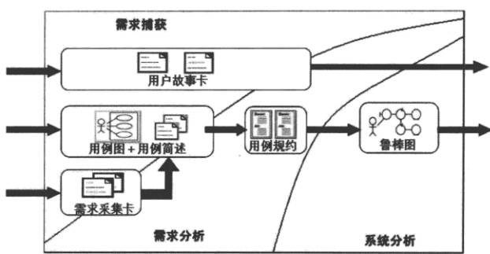
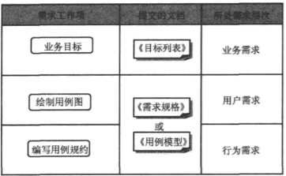
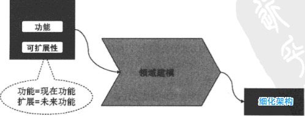
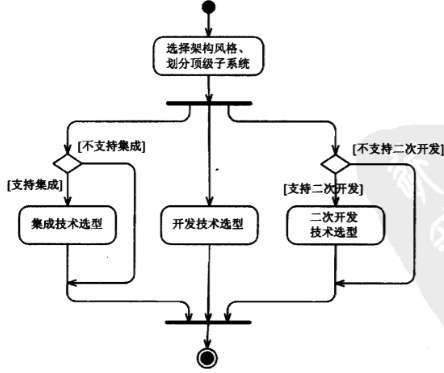

读《程序员向架构师转型必备》
===

<q>
机会、人才、技术和产品是公司成长的主要牵动力。机会牵引人才，人才牵引技术，技术牵引产品，产品牵引更大机会。人才锁找我的知识处于最核心的部位。 -- 《华为研发》
</q>

读完本书，颇有点相逢恰当时之感。内容翔实，而指导性又非常强，很多内容点自己在实际工作中深有感触。其纸质书亦作为自己又一本收藏案头书，进行查阅回顾温习。可惜的是没有正版电子版，只能下本不太清晰的盗版电子书放在手机随时查阅了。

- - -

+ 以能力层次来看，程序员成金字塔型，中高端人才缺失；以学历层次来看，程序员成橄榄型，本科学历最多。

+ 软件企业发展的好坏取决于如下因素：

<blockquote>
+ 员工素质
+ 人才结构
+ 员工职业技能的纵深积累
+ 员工职业技能的适时更新
</blockquote>

+ 纯粹靠从外部招人的人才策略不现实。

+ 架构设计主要思想：

<blockquote>
#### 分而治之

+ 聚焦不同方面，更有效思考。
+ 化大问题为子问题。

#### 迭代式设计

+ 不同视图设计交替迭代展开。
+ 逻辑划分逐步清晰，促进物理分布设计；反之亦然。
</blockquote>

+ 架构设计主要视图：

<blockquote>
+ 逻辑视图
+ 物理视图

|逻辑视图||物理视图|
|--|--|--|
|浅层设计| >> |浅层设计|
|<<||<<|  
|深层设计|>>|深层设计|
</blockquote>

+ 小系统和大系统的架构设计之不同，首先是概念架构上的不同，而归根溯源这是由于架构锁支撑的“关键需求”不同造成的。整个架构设计过程中的“确定关键需求”这一环节，可谓小系统和大系统架构设计的“分水岭”。

+ **概念架构**指系统目标的设计思想、重大选择。《方案建议书》《技术白皮书》和市场彩页中，都有它的身影，以说明产品/项目/方案的技术优势。因此，也成为“市场（业务）架构”。

+ 概念架构设计内容：

<blockquote>
**一个决定：**

划分顶级子系统

**四个选型：**

+ 架构风格选型
+ 开发技术选型
+ 集成技术选型
+ 二次开发技术选型
</blockquote>

+ 如何做概念架构设计：

<blockquote>
+ 首先，选择架构风格、划分顶级子系统。两者相互影响、相辅相成。
+ 然后开发技术选型、集成技术选型、二次开发技术选型。三者紧密相关、同时进行。集成技术和二次开发业可能不需要。
</blockquote>

+ 破解领域知识不足的有效方法：把领域模型作为“理解领域的手段”。领域模型的强项是“理顺概念关系、搞清业务规则”，通过对复杂领域进行“概念抽象”和“关系抽象”建立模型、获得对领域知识总体上的把握。

+ 软件架构的定义：

<blockquote>
**组成派**

软件架构将系统描述计算组件及组件间的交互。关注软件本身。

**决策派**

软件架构是在一些重要方面所作出的决策的集合。关注实践主体--人。

这些重要决策如下：

+ 模块如何划分。
+ 每个模块的职责如何。
+ 每个模块的接口定义。
+ 模块间的交互机制。
+ 开发技术选型。
+ ...
</blockquote>

+ 软件架构师分与合的艺术。

+ 架构设计是一棵决策树：

+ 软件是由递归的组件的递归组成的。系统、子系统和框架均需要架构设计。

+ 架构就是对**复杂单元**进行分解，并规定各部分之间的交互。

+ 架构设计的几个误解：

<blockquote>
+ 架构设计是技术选型
+ 架构设计是通用模块
+ 投标PPT中的架构就是架构的全部
</blockquote>

+ 在使用第三方库时候，如果希望将来可以替换该SDK，那么可以采用适配器模式：定义一套业务接口，实现接口（调用第三方库）。

+ 架构设计是一门解决复杂性的**艺术**。

+ 架构的不同受众者需要的“架构的样子”是不一样的。因此，架构师需要以不同的视图架构。

<blockquote>
技术经理：软件架构就是模块的划分和接口定义。
系统分析师：软件架构就是业务领域模型的关系建模。
数据库工程师：软件架构就是规定了数据结构，其他只不过是对数据的操作而已。
部署工程师：软件架构就是规定了软件部署到硬件的策略。
...
</blockquote>

+ 为用户设计，不仅满足用户需求的功能，也要达到用户期望的质量。

+ 客户 ≠ 最终用户

+ 先研究需求，再设计架构，然后交由开发人员实现。作为架构，不仅要为用户服务，还要为“下游”的开发人员设计。需求不仅包含用户的需求，也包含开发人员的需求。比如易测试性功能需求。

+ 软件复杂体现在两个方面：1. 软件本身的复杂性；2. 团队管理复杂性。

+ 开发人员之间的依赖源于他们负责的程序之间的依赖性。要清楚管理人员的协作，就必须清晰划分模块（子系统）。架构是**开发**和**管理**的核心。

+ 架构师应当为项目相关的不同角色而设计。手段就是多视图：

<blockquote>
+ 架构师要为“上游”客户负责，为他们的业务目标和约束条件负责。
+ 架构师要为“上游”用户负责，使他们关心的功能需求和运行质量属性得以满足。
+ 架构师必须顾及“下游”开发人员的协作分工。
+ 架构师必须考虑周边的管理人员，如配置管理员、运维工程师等。
</blockquote>

+ 一个架构视图是对于从某一视角或某一点上看到的系统所做的简化描述，描述中涵盖了系统的特定方面，而忽略了与之无关的其他方面。

+ 架构设计是一种手段：

<blockquote>
+ 架构设计包含太多决策，超过了人脑“一蹴而就”的能力范围，因此，采用“分而治之”的办法从不同视角分别设计。
+ 同时为软件架构的理解、交流、归档提供便利。
</blockquote>

+ 使用逻辑视图和物理视图刻画大局非常有效。、

+ 软件的逻辑架构（视图）规定了软件系统的逻辑单元及交互。具体指逻辑层、功能子系统、模块等。其核心任务是识别模块、规划接口，明确模块间使用关系和使用机制。

+ 软件的物理架构（视图）规定了组成系统的物理元素以及它们之间的联系和交互、部署和硬件策略等。

+ 分布式系统的流行，使得“物理层”的概念和设计比较流行和常态了。

+ 多视图≠多阶段，不应瀑布式的设计每个视图，而是应该迭代式设计。尤其对于大型系统而言，完全设计好逻辑视图后，再设计物理视图，是有很大问题的。

+ 程序员向架构师转变，难在何处？难在必须“试着做起来”，并慢慢积累感觉，进而积累经验。

+ “需求决定架构”之所以是一句废话，在于其并没有告诉开发人员“如何做架构设计”。

+ 架构设计三个原则：

<blockquote>
+ 看透需求。架构师可能不是“需求”和“领域模型”的负责人，但必须深入了解。
+ 大方向（即概念架构）正确。“关键需求”决定“概念架构”。
+ 覆盖各个方面。通过多视图方法细化架构，满足不同角色的需求。
</blockquote>

+ 看透需求，不仅要把需求找全，还要把需求项之间的矛盾关系、追溯关系搞清楚。

+ 越是复杂的系统，越需要多视图设计。这样才能把问题研究和表达清楚。

+ 什么是概念架构（架构大方向）：

<blockquote>
+ 作为架构师，进行大中型系统设计时，应该先比较几种主流概念架构。
+ 如果是售前，你所提到的架构，就是概念架构。
+ 如果你去投标，那么你提到的也是概念架构。
</blockquote>

+ 有经验的架构师不会一上来就关注“模块+接口”设计，而是优先关注：1. 重大需求；2. 特色需求；3. 高风险需求。

+ 架构设计六大步骤：

<blockquote>
1. 需求分析
2. 领域建模

领域建模的目的在于：透过问题领域的重重现象，捕捉其背后最为稳固的概念以及这些概念之间的联系。架构师本人最好是作为领域建模的领导者。

3. 确定关键需求
4. 概念架构设计

概念架构设计必须给出“一个决定、4个选型”。

5. 细化架构设计

指从五个不同视图进行设计：逻辑架构、开发架构、运行架构、物理架构、数据架构。

6. 验证架构设计
</blockquote>

+ 需求分析工作内容：

<blockquote>
1. 需求沟通。
2. 确定非功能需求。

这是一个持续过程。

3. 需求分析主线。

</blockquote>

+ 领域建模的精髓是“业务决定功能，功能决定模型”。领域建模的输入是**当前的功能**和**未来的功能**。

+ 关键需求决定架构大方向。

+ 概念架构设计输入是“关键需求”，输出是“一个决定，四个选择”：

+ 概念架构和细化架构的关键区别是：概念架构没有设计到“模块”+“接口”一级，而细化架构必须关注“模块”+“接口”：

+ 架构验证需要根据情形判断是否有必要。其目的在于尽早将那些有风险的重要部分开发出来，及早验证。

+ 需求分析必须基于“业务利益”：解决问题、创造机会、提高管控力。

+ 软件开发与交付流程：

其中概念化阶段主要聚焦：

1. 愿景分析
2. 风险评估
3. 可行性分析（比如硬件支撑等）
4. 项目进度和成本预估

+ 需求分析=愿景分析+需求分析

+ 愿景分析项目、产品、解决方案的起源问题。对于定制软件而言，应由需方高层牵头；对于产品软件而言，应由市场部门的牵头。愿景分析必须阐述业务需求、及其产生的背景和理由。

+ 愿景分析最重要的文档就是《愿景与范围文档》，项目型公司可能叫《项目立项书》，产品型公司可能叫《产品需求书》或《市场需求书》：

<blockquote>
+ 业务需求
  a) 背景
  b) 业务机遇
  c) 业务目标
  d) 客户或市场需求 
  c) 提供给客户的价值
  f) 业务风险

+ 项目愿景解决方案
  a) 愿景陈述
  b) 主要特征
  c) 假设和依赖
  
+ 范围和局限性
  a) 首次发布范围
  b) 随后发布范围
  c) 局限性和专用性
  
+ 业务环境
  a) 客户或用户概貌
  b) 项目优先级

+ 成功的因素
</blockquote>

+ 上下文图的目的是明确系统相关的外部因素和事件，促进更完整的认识系统需求和外部约束。通常将**待研发系统**放在上下文图的中间，不展示系统的任何内部结构。**只关注系统外围，不关注系统内部**。

+ 上下文图常见三种画法：

1. 顶层数据流图。
2. 将System处理成黑盒的用例图。
3. Powerpoint绘制的框图。

+ 愿景分析其实就是“需求调研”，前者重目标，后者重活动。

+ 愿景分析实践要领：

+ 范围、特性、上下文图是刻画高层需求的“三剑客”：

+ 软件需求的定义：为用户做什么？

+ 软件需求“上承愿景”，“下接设计”。需求分析要在《愿景与范围文档》的基础之上，进一步细化软件需求，将需求转化为**功能定义**。

+ 需求分析分为三个任务：

<blockquote>
1. 需求捕获 -- 理解沟通

2. 需求分析 -- 做什么

3. 系统分析 -- 怎么做
</blockquote>

三者不是独立无关的阶段，而是相互伴随、交叉进行的。

+ 典型的需求捕获是使用“需求采集卡”：需求描述、需求提出者、需求记录者、需求类型等。

+ 需求捕获得到的是“原始需求”，而需求分析则对其【**用户(人)的需求**】进行分析、整理、归纳、论证形成明确的**软件需求**。

+ 需求分析要形成明确规范的《需求规格说明书》，使用**用例图**聚焦每个功能刻画系统行为。

+ 需求的分类：

<blockquote>
**第一纬度**

+ 组织需求（工期、资金、遗留系统整合等等）
+ 用户需求（用户完成哪些工作）
+ 开发需求（开发人员需要实现什么、开发和维护期考量）

**第二纬度**

+ 功能需求（直接业务需求）
+ 质量属性（运行期质量）
+ 约束需求（业务环境因素+使用环境因素+构建环境因素+技术环境因素）
</blockquote>

+ 需求分析的“三横两纵”：

<blockquote>
+ 三横
  1. 确定系统目标
  2. 研究高层需求
  3. 建立用例模型
  
+ 两纵
  1. 需求沟通、需求启发、需求验证
  2. 确定非功能需求
</blockquote>

+ 在需求分析过程中需要和客户不断沟通，这时客户希望能够看到具有实际感的界面。为此，应该在需求分析阶段就开始界面设计，并用其辅助和客户交流。但界面设计不应放在《需求规格书》中，它是设计而非需求。**界面原型可以启发需求**。

+ 《软件需求规格说明书》是需求分析工作的最重要成果。

+ 常用的用例技术包括：用例图、用例简述、用例规约（详述）、鲁棒图（用例实现）。以“需求层次”（业务需求、用户需求、行为需求）为背景，对四种技术的使用和定位进行分析：

+ 用例规约就是用例的详细称述，一般应用在比较复杂的用例中。以下是一份典型的用例规约：

<blockquote>
1. 用例名称：

银行销户

2. 简要说明：

xxxxxx。

3. 事件流：

3.1 基本事件流

1) 银行工作人员进入“活期账户销户”界面。 
2) 银行工作人员读取磁条卡片信息。
3) 系统展示账户信息
4) 工作人员核对证件材料
5) ...

3.2 扩展事件流

1) 如果磁卡读取失败，需手动输入账号
2) ...

4. 非功能需求：

5. 前置条件:

6. 后置条件：

7. 优先级

高。
</blockquote>

+ 用例图 + 用例简述可以应用于**需求捕获**，或业务不太复杂的系统的**需求分析**。

+ 用例规约应用于**需求分析**和**需求规格定义书**。

+ 用例实现（鲁棒图）应用于**初步设计**。用例是需求，鲁棒图已经是设计。

+ 基于用例的需求分析方法：

+ 《需求规格书》需要区别对待每个用例，并不是每个用例都有必要细化到用例规约的程度。

+ 典型的《需求规格书》：

+ 需求变更对**用例图**和**用例简述**的影响小，而对**用例规约**和**用例实现**的影响大，因此，实践中应该“推后用例细化、激发需求变更”。

+ 实践中是实践决定方法，而不是方法一刀切实践。需求分析的流程可以根据系统特性，定义为“大中小”三套流程：

1. 小型系统

2. 中型系统

3. 大型系统

在大型系统中要避免一开始就画用例图，而应当首先尽可能的勾画出主要流程图，并层层细化流程，从而促进发现用例。

+ 领域模型比《领域词汇表》更进一步，其不仅关注领域概念，更刻画它们之间的联系。

+ 领域模型最常采用UML中的类图和状态图进行表述。类图是主要表现手段，状态图进行辅助表示。

+ 领域层与视图层关系（视图层）密切；同时其对数据持久化（数据层）也影响巨大。经过精化的领域模型也将是业务层的核心。由此可见，领域模型对系统各个层面都有影响，其重要性不言而喻。

+ 领域模型依赖于客户的深度参与，因此，需求分析人员或架构师必须积极调动客户参与度。

+ 领域知识的核心是领域概念之间的联系。

+ 破解“陌生领域知识不足”的关键是“理顺概念关系、搞清业务规则”。

+ 领域模型是对领域问题某种程度抽象，抽象就意味着有目的性的忽略。

+ 领域建模影响功能扩展，那么，反过来，就可以使用“功能扩展”驱动“领域建模”。

+ 架构设计时，“确定关键需求”要一次做对！

+ 关键需求决定架构，其余需求验证架构。

+ 架构师没有精力对“所有需求”进行深入分析，这是现实；架构师没有必要对“所有需求”进行深入分析，这是策略。

+ 概念架构指定义高层组件及其联系，不应涉及接口。

+ 设计思想必须和“核心（直接）目标”相联系。

+ 概念架构贵在针对性，“直指目标”、“设计思想”、“重大选择”是它的三大特征。

+ 概念架构中关注高层组件，这些应该只有职责，而没有接口。

+ 需求和设计之间存在“鸿沟”：

1. 用例是面向问题域的，而设计是面向机器域的。
2. 用例技术本身不是面向对象的，而设计应该面向对象。
3. 用例规约采用自然语言描述，而设计采用形式化的模型表述（如UML）等。

+ 从功能设计到设计的鸿沟需要“桥”：鲁棒图。鲁棒图设计之初的目的是用以回答“每个用例都需要哪些对象”。

+ 概念架构设计任务顺序：

+ 可以根据系统复杂度，来灵活把握对多少“关键功能”进行“鲁棒图设计”。

+ 对于个人能力的培养，对比备选设计、评审设计优缺点，能够洞察设计的“所以然”，是非常有效的方式。

+ 和2视图法相比，5视图法更适合大型系统。

+ 架构视图是设计架构、描述架构的核心手段。

+ 程序员向架构师转型的关键是“学会系统思考”。对软件系统而言，系统思考就是对复杂系统各个构件之间的联系深入探究。

+ 架构设计5视图：

+ 架构设计的15个任务：

+ 逻辑架构任务：

1. 职责划分（逻辑层、子系统、模块、管件类）
2. 职责协作（接口、协作关系）

核心任务是**模块划分、接口定义、领域模型细化**。静态方面使用UML包图、类图、对象图；动态方面使用序列图、协作图、状态图、活动图。

+ 逻辑架构一般细化到模块级别，但对如下几种情况，需要可细化到类：

1. 接口定义类
2. Facade类
3. 核心控制类
4. 领域模型中的核心类

+ 领域建模时一般并不区分“接口”和“类”，通常都是作为“一般类”定义的。而到了细化架构阶段，需要对领域模型细化到可以编程的程度，此时就必须明确区分“接口”和“类”，同时某些“类”要降级为“属性”，而某些“属性”可能升级为“类”。

+ 软件架构设计的难点在于：它是跨越现实世界（问题领域）到计算机世界（解决方案）之间的鸿沟。

+ 需求分析的意图是**明确“问题领域”**，架构设计的意图是完成面向问题到面向解决方案的转换。

+ 功能树 vs 功能模块结构图

1. 前者是功能分解结构，后者是对系统进行结构分解的结构示意图。
2. 前者刻画问题领域，后者刻画解决方案。
3. 前者是需求分析层面，后者是设计层面。
4. 前者是架构师从上层（需求分析师）得到的，后者是架构师亲自设计出来的。

+ 从功能树到功能模块，是**粗粒度**功能模块划分的常见手段。

+ 如何与需求人员交流沟通，是架构师的应有的技能。

+ 功能树不是界面结构图。

+ 描述需求的序列图，描述的是“内外对话”；描述设计的序列图，描述的是“内部（对象）协作”。

+ 用例驱动的模块划分：

1. 第一步，回答“实现用例需要哪些类”的问题。运用鲁棒图、序列图。
2. 第二部，回答“这些类应该划分到哪些模块”的问题。运用包图。

+ 鲁棒图是类图，不是序列图。鲁棒图中的连线并不是严谨的对象间协作关系。

+ 用例驱动的设计时，没必要每个用例都画序列图或鲁棒图。而应找关键用例（与关键需求相关）。

+ 用例驱动的设计优缺点：

1. 用例多，从用例到类，再到模块，设计工作量大。
2. 适用于不熟悉的领域软件
3. 如果运用太死板，会落入“先详细设计，再架构设计”的陷阱。
4. 为后续详细设计提供了便利，因此受到“程序组长”的欢迎。

+ 模块划分技能的四种思路：

+ 设计思维融合的关键是，把层、功能模块（子系统）、细粒度模块这三个概念看透：

1. 一个细粒度模块，必然位于架构的某一层中。
2. 一个细粒度模块，必然位于架构的某一功能模块中。

+ EDD（封装驱动设计方法）是的目的是：细粒度模块划分。综合运用分层、分层细化、功能模块、通用模块、通用机制框架化等手段，是该方法的核心特点。

+ EDD的步骤：

1. 研究需求
2. 粗粒度分层
3. 细粒度划分模块
4. 用例驱动的模块划分结构评审、优化。

+ 对模块划分促进最大的需求成果是**上下文图**和**功能树**。

+ EDD步骤：

